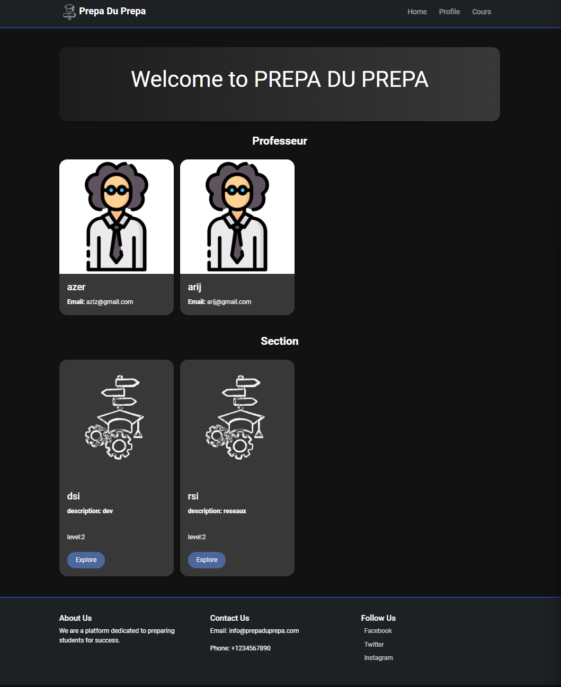
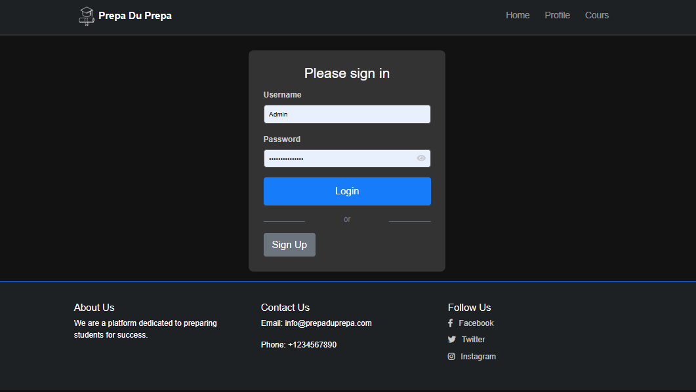
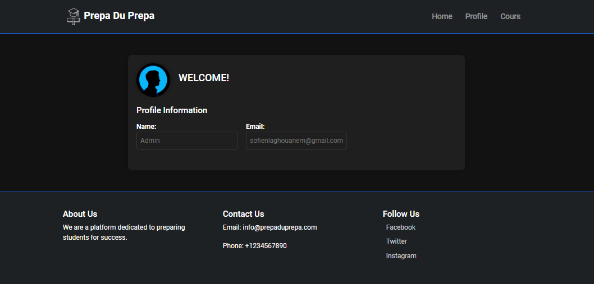

# Prépa du Prépa (Django)

**Prépa du Prépa** is a web platform designed to provide essential resources and tools for engineering students preparing for competitive exams. Built with the Django framework, this project aims to create an efficient and user-friendly interface for accessing preparatory materials, sharing knowledge, and enhancing the learning experience.


## Features

- **User Authentication**: Secure login and registration system for users.
- **Resource Management**: Upload and access study materials categorized by subject.
- **Collaborative Learning**: Discussion forums for students to exchange ideas and resolve queries.
- **Search Functionality**: Quickly find relevant resources and topics.
- **Admin Dashboard**: Manage user accounts, resources, and site configurations.

## Technologies Used

- **Backend**: Django (Python)
- **Frontend**: HTML, CSS, JavaScript
- **Database**: SQLite (default Django database)
- **Others**: Django ORM, Bootstrap for styling

## Pictures

Here are some screenshots of the platform:

1. **Home Page**  
   

2. **Authentification**  
   

3. **Profile Page**  
   


## Installation

Follow these steps to set up the project locally:


1. Clone the repository:
   ```bash
   git clone https://github.com/CodeWizard-404/Prepa-Du-Prepa--Django.git
   ```
2. Navigate to the project directory:
   ```bash
   cd Prepa-Du-Prepa--Django
   ```
3. Create a virtual environment and activate it:
   ```bash
   python -m venv venv
   source venv/bin/activate  # For Windows: venv\Scripts\activate
   cd PrepaDuPrepa
   ```
4. Apply migrations:
   ```bash
   python manage.py migrate
   ```
5. Run the development server:
   ```bash
   python manage.py runserver
   ```

## Usage

- Open a browser and go to `http://127.0.0.1:8000/` to access the platform.
- Register as a new user or log in to access the features.
- Explore resources, participate in discussions, or manage content if you are an admin.

## Contributing

We welcome contributions! To contribute:

1. Fork the repository.
2. Create a new branch for your feature:
   ```bash
   git checkout -b feature-name
   ```
3. Commit your changes and push to your fork:
   ```bash
   git push origin feature-name
   ```
4. Open a pull request.

## License

This project is licensed under the MIT License. See the LICENSE file for details.

## Contact

For queries or suggestions, reach out via [GitHub Issues](https://github.com/CodeWizard-404/Prepa-Du-Prepa--Django/issues).

